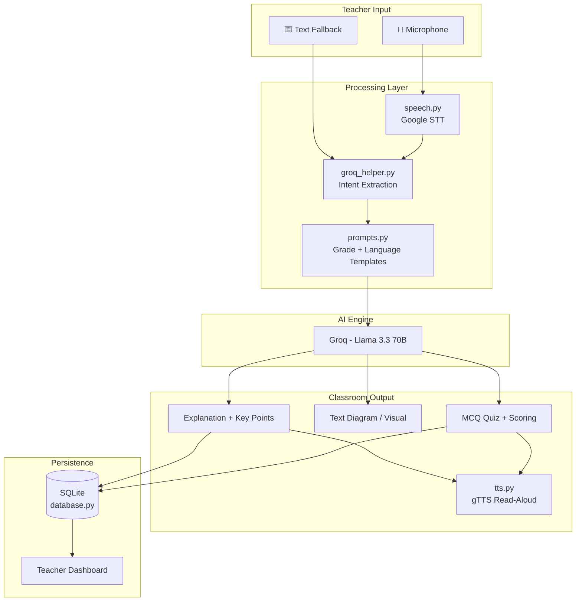

# ClassMate AI 📚

**Hands-free AI Classroom Co-pilot for Government School Teachers**

Built for the **Connecting Dreams Foundation — Round 2 Technical Assignment**

ClassMate AI helps teachers in Haryana government schools deliver engaging, grade-appropriate lessons through voice commands — no technical expertise required. Speak a topic, and the app explains it in simple Hinglish, projects visuals for the smart board, and runs interactive quizzes with spoken questions.

---

## Features

### Core (Required)

| Feature | Description |
|---------|-------------|
| **Live Concept Simplification** | Voice/text → STT → Groq AI generates Hinglish explanation, key points, and text diagram |
| **Voice Triggered Quizzing** | "Create a quiz" or "Quiz me on X" → 4 MCQs, TTS read-aloud, scoring with highlights |

### Bonus

| Feature | Description |
|---------|-------------|
| **Bilingual Support** | Hindi, English, and Hinglish language modes |
| **Class Level 1–10** | AI adapts vocabulary and complexity per grade |
| **Teacher Dashboard** | SQLite-backed usage stats and recent activity log |
| **Smart Board Mode** | Large fonts, high contrast, projection-ready UI |
| **Accessibility** | Voice-first, large buttons, minimal typing |

---

## Architecture



### Project Structure

```
classmate-ai/
├── app.py                  # Main Streamlit application
├── requirements.txt
├── .env.example
├── README.md
├── assets/
└── utils/
    ├── prompts.py          # System + task prompt templates
    ├── groq_helper.py      # Groq API wrapper (Llama 3.3 70B)
    ├── speech.py           # Speech-to-text (Google STT)
    ├── tts.py              # Text-to-speech (gTTS)
    ├── quiz.py             # Quiz scoring logic
    ├── database.py         # SQLite activity logging
    └── visuals.py          # Smart board HTML/CSS rendering
```

---

## Installation

### Prerequisites

- Python 3.10+
- [FFmpeg](https://ffmpeg.org/) (required by pydub for audio conversion)
- Groq API key ([get one free](https://console.groq.com/keys))

### Steps

```bash
# 1. Clone or download the project
cd classmate-ai

# 2. Create virtual environment
python -m venv venv

# Windows
venv\Scripts\activate

# macOS/Linux
source venv/bin/activate

# 3. Install dependencies
pip install -r requirements.txt

# 4. Configure environment
copy .env.example .env        # Windows
# cp .env.example .env        # macOS/Linux

# Edit .env and add your GROQ_API_KEY

# 5. Run the app
streamlit run app.py
```

Open **http://localhost:8501** in your browser.

---

## Usage Guide (For Teachers)

### Step 1 — Set Classroom Settings (Sidebar)

1. Choose **Language Mode**: Hinglish (recommended), Hindi, or English
2. Select **Class Level** (1–10)
3. Toggle **Smart Board Mode** when projecting

### Step 2 — Explain a Topic

**Speak or type:**
- *"Explain photosynthesis for class 5"*
- *"Explain water cycle for class 6"*
- *"Explain fractions for class 3"*

The app shows:
- Friendly teacher-style explanation
- Key points for the board
- Text-based diagram (e.g., Water Cycle flow)
- Option to read explanation aloud

### Step 3 — Run a Quiz

**Speak or type:**
- *"Create a quiz"*
- *"Quiz me on photosynthesis"*

The app:
- Generates 4 grade-appropriate MCQs
- Reads questions aloud (TTS)
- Shows score and highlights correct answers after submit

### Quick Demo Buttons

Use the one-click demo buttons on the home screen for instant evaluation demos.

---

## Deployment (Streamlit Community Cloud)

1. Push the project to a **public GitHub repository**
2. Go to [share.streamlit.io](https://share.streamlit.io)
3. Click **New app** → select your repo
4. Set **Main file path**: `app.py`
5. Add secrets in **Advanced settings → Secrets**:

```toml
GROQ_API_KEY = "your_actual_api_key"
DEFAULT_LANGUAGE = "hinglish"
DEFAULT_CLASS_LEVEL = "5"
DATABASE_PATH = "data/classmate.db"
```

6. Deploy — the app will be live at `https://your-app.streamlit.app`

> **Note:** Speech-to-text requires internet (Google Web Speech API). gTTS also needs network access.

---

## Prompt Engineering

### System Prompt

All AI calls use this foundation (see `utils/prompts.py`):

```
You are an AI Teaching Assistant helping government school teachers in India.

Rules:
1. Explain concepts in simple Hinglish.
2. Adapt to student grade level.
3. Use practical examples from daily life.
4. Keep responses concise.
5. Avoid technical jargon.
6. Encourage curiosity.
7. Generate educational diagrams when useful.
8. Always maintain educational accuracy.
```

### Grade Adaptation Strategy

Each class level (1–10) has explicit complexity instructions:

| Class | Strategy |
|-------|----------|
| 1–3 | Very simple words, 1–2 sentences, home/family examples |
| 4–6 | Clear structure, local Indian context, cause-effect |
| 7–8 | Moderate detail, terms defined simply |
| 9–10 | Comprehensive, board-exam-ready basics |

### Language Modes

| Mode | Instruction to Model |
|------|---------------------|
| **Hinglish** | Natural Hindi-English mix as spoken in Haryana classrooms |
| **Hindi** | Simple Devanagari Hindi, short sentences |
| **English** | Simple Indian English, no complex vocabulary |

### Structured JSON Outputs

Explanations and quizzes use strict JSON schemas so the UI can reliably render key points, diagrams, and MCQ options without parsing free text.

### Intent Extraction

Voice commands are first parsed by Groq AI to detect:
- `intent`: `explain` or `quiz`
- `topic`: extracted subject
- `class_level`: overridden if mentioned in speech

A local regex fallback (`speech.parse_voice_command`) handles offline/API-failure cases.

---

## Localization Strategy

| Layer | Approach |
|-------|----------|
| **UI Labels** | English with Hinglish helper text (familiar to teachers) |
| **AI Content** | Fully localized via language mode selector |
| **Speech Input** | `hi-IN` and `en-IN` locale fallbacks for noisy classrooms |
| **TTS Output** | Hindi (`hi`) for Hinglish/Hindi modes; English (`en`) for English mode |
| **Examples** | Indian daily-life context (village, monsoon, crops, school) baked into prompts |

### Future Localization

- Full Devanagari UI translation file
- Regional dialect tuning (Haryanvi phrases)
- Offline Indic TTS (AI4Bharat models)

---

## Human-Centered Design Decisions

| Challenge | Solution |
|-----------|----------|
| Teacher not tech-savvy | One-click demo buttons, voice-first, minimal menus |
| Noisy classroom | Text input fallback, ambient noise adjustment in STT |
| Unstable internet | Local intent parser fallback, clear error messages in Hinglish |
| Limited prep time | Quick commands, auto grade/topic detection from speech |
| Smart board projection | Dedicated mode: large fonts, high contrast, hidden sidebar |
| Low digital literacy | Large buttons, emoji icons, calm blue color palette |

---

## Environment Variables

| Variable | Required | Default | Description |
|----------|----------|---------|-------------|
| `GROQ_API_KEY` | ✅ | — | Groq API key (free at console.groq.com) |
| `DEFAULT_LANGUAGE` | ❌ | `hinglish` | Default language mode |
| `DEFAULT_CLASS_LEVEL` | ❌ | `5` | Default class level |
| `DATABASE_PATH` | ❌ | `data/classmate.db` | SQLite database path |

---

## Future Roadmap

### Phase 1 — Classroom Hardening
- [ ] Offline Whisper STT for low-connectivity schools
- [ ] Session export (PDF lesson plan from explanation)
- [ ] Student response collection via QR code

### Phase 2 — Content & Curriculum
- [ ] NCERT chapter mapping (auto-suggest topics by syllabus)
- [ ] Pre-built diagram library for common science/math topics
- [ ] Multi-language UI (full Hindi Devanagari interface)

### Phase 3 — Analytics & Scale
- [ ] Weekly teacher usage reports
- [ ] Topic difficulty feedback loop
- [ ] Multi-teacher school dashboard
- [ ] Integration with state education portals

### Phase 4 — Advanced AI
- [ ] Image generation for smart board (Gemini Imagen)
- [ ] Real-time student doubt handling
- [ ] Adaptive quiz difficulty based on class performance

---

## Tech Stack

| Component | Technology |
|-----------|------------|
| Framework | Streamlit |
| AI Model | Llama 3.3 70B via Groq API |
| Speech-to-Text | Google Web Speech API (via SpeechRecognition) |
| Text-to-Speech | gTTS |
| Database | SQLite |
| Config | python-dotenv |

---

## Troubleshooting

| Issue | Fix |
|-------|-----|
| `GROQ_API_KEY is not set` | Create `.env` from `.env.example` and add your Groq key |
| Audio transcription fails | Check microphone permissions; use text input fallback |
| `pydub` / audio errors | Install FFmpeg and add to system PATH |
| gTTS not working | Ensure internet connection is active |
| Database errors | Delete `data/classmate.db` and restart (resets stats) |

---

## License

Built as an educational submission for Connecting Dreams Foundation. Free to use and adapt for government school classrooms.

---

## Acknowledgments

- **Connecting Dreams Foundation** — for the mission to empower government school teachers
- **Groq** — for ultra-fast, free AI inference
- **Meta Llama** — for open-source AI models powering education
- **Haryana's teachers** — whose daily challenges inspired every design decision

*ClassMate AI — because every child deserves a great explanation.* 🌱
